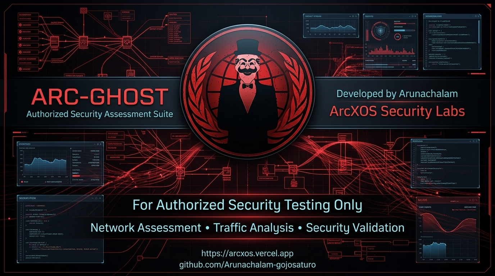
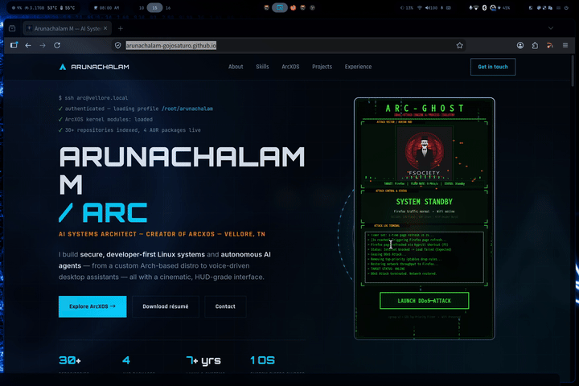

# ARC-GHOST :: Authorized Security Assessment Suite



<p align="center">
  
  
  
  
</p>

---

## 🛡️ Overview

**Arunachalam's ARC-GHOST** is an advanced, cyberpunk-themed Authorized Security Assessment & Targeted Process Isolation Suite designed for Linux environments. Developed by a 7-year veteran builder based in (Tamil Nadu), India.

ARC-GHOST enables security researchers and system administrators to simulate DDoS traffic floods and isolate specific application network vectors (such as Mozilla Firefox) **in real-time**—all while preserving 100% of the host machine's global WiFi, Ethernet, and background system connections.

- 🌐 **Official Website:** [https://arcxos.vercel.app](https://arcxos.vercel.app)
- 🐙 **GitHub Repository:** [github.com/Arunachalam-gojosaturo/Ddos](https://github.com/Arunachalam-gojosaturo/Ddos.git)
- 📦 **AUR Package:** `yay -S ddos`
- 👤 **Developer:** Arunachalam (**ArcXOS Security Labs**)

---

## 📽️ Live Demonstration Showcase

<p align="center">
  
</p>

Below is the full screen recording demonstration (`demo.mp4`) showing **ARC-GHOST** in action—real-time process detection, network isolation, cyberpunk telemetry HUD, packet flood visualizer, and 3-second automated page refresh reloads.

https://github.com/Arunachalam-gojosaturo/Ddos/raw/Main/assets/demo.mp4

<p align="center">
  <video src="https://github.com/Arunachalam-gojosaturo/Ddos/raw/Main/assets/demo.mp4" controls="controls" autoplay loop muted width="100%" poster="https://raw.githubusercontent.com/Arunachalam-gojosaturo/Ddos/Main/assets/arc_ghost_header.jpg">
    Watch the demonstration video directly: <a href="https://github.com/Arunachalam-gojosaturo/Ddos/raw/Main/assets/demo.mp4">assets/demo.mp4</a>.
  </video>
</p>

---

## ⚡ Key Features

- 🎯 **Zero-Restart Targeted Isolation**: Uses Linux `cgroup v2` (`/sys/fs/cgroup/arcghost`) & top-priority firewall rules (`iptables` / `ip6tables` `-I OUTPUT 1`) to block application network traffic immediately **without restarting the browser or closing open tabs**.
- 📡 **System Network Integrity**: Global WiFi, SSH, Discord, terminals, and background services remain **100% online and unaffected**.
- 💥 **Cyberpunk Telemetry HUD**: Features matrix rain animations, dynamic frequency visualizers, live Gbps bandwidth metrics, packet flood counters, and terminal event streams (`SYN Flood`, `UDP Storm`, `HTTP Burst`).
- 🔄 **3-Second Auto-Refresh Reload**: 3 seconds after isolation is launched, ARC-GHOST dispatches a single `F5` page refresh to target windows via compositor/display shortcuts (`hyprctl`, `xdotool`, `wtype`, `ydotool`), confirming connection termination.
- 👁️ **Real-time Process Watcher**: Auto-detects newly spawned target processes (e.g., launching new Firefox instances) and attaches them to the isolation cgroup dynamically within 0.5 seconds.
- 🎛️ **Dual Operational Modes**: Complete GUI interface (`arc_ghost.py`) or headless command-line utility (`scripts/fxblock.sh`).

---

## 🔬 Technical & Security Architecture

```
                               ┌─────────────────────────┐
                               │     System Kernel       │
                               └────────────┬────────────┘
                                            │
                    ┌───────────────────────┴───────────────────────┐
                    ▼                                               ▼
     ┌─────────────────────────────┐                 ┌─────────────────────────────┐
     │   Target App (Firefox)      │                 │  Global System Applications │
     │   Attached PIDs in cgroup   │                 │ (WiFi / SSH / Terminals)    │
     └──────────────┬──────────────┘                 └──────────────┬──────────────┘
                    │                                               │
                    ▼                                               ▼
     ┌─────────────────────────────┐                 ┌─────────────────────────────┐
     │ cgroup v2 & GID DROP Filter │                 │ Unrestricted Output Chains  │
     │  (IPv4/IPv6 Top-Priority)   │                 │  (Normal Network Traffic)   │
     └──────────────┬──────────────┘                 └──────────────┬──────────────┘
                    │                                               │
                    ▼                                               ▼
         [ NETWORK SEVERED / BLOCKED ]                      [ 100% ONLINE ]
```

1. **`cgroup v2` Subsystem Control**: ARC-GHOST creates `/sys/fs/cgroup/arcghost` and dynamically writes targeted PIDs into `cgroup.procs`.
2. **Top-Priority Firewall Filtering**: Injects `-I OUTPUT 1` rules for both `cgroup` paths and `--gid-owner` fallbacks, superseding standard Linux route tables.
3. **Socket Clearing (`ss -K`)**: Clears existing active TCP/UDP sockets owned by target PIDs to prevent existing keep-alive connections from bypassing newly injected firewall rules.

---

## 💻 Installation & Requirements

### Option 1: Arch Linux (AUR)

Install directly via `yay`:

```bash
yay -S ddos
```

### Option 2: Manual Installation

```bash
# Clone the repository
git clone https://github.com/Arunachalam-gojosaturo/Ddos.git
cd Ddos

# Install optional Python dependencies (for enhanced image rendering)
pip install -r requirements.txt
```

---

## 🚀 Usage Guide

### 1. Launch GUI Interface

```bash
python3 arc_ghost.py
```

- Enter your `sudo` password when prompted once in the terminal.
- Click **LAUNCH DDoS ATTACK / ISOLATE** to trigger process isolation, packet flood telemetries, and 3-second page refresh verification.
- Click **END ATTACK / RESTORE** to safely clear all firewall rules and restore full internet connectivity to target processes.

### 2. Launch Headless CLI Mode

For headless servers or lightweight terminal environments:

```bash
sudo ./scripts/fxblock.sh
```

- Press `Ctrl+C` at any time to clean up rules and exit cleanly.

---

## 📂 Project Structure

```
Ddos/
├── assets/
│   ├── arc_ghost_header.jpg    # 16:9 Cyberpunk Header Banner
│   ├── demo.mp4                # Screen Recording Video Demonstration
│   ├── robot.png               # Cyberpunk Avatar Emblem
│   └── robot.jpg               # Avatar Emblem Fallback
├── scripts/
│   └── fxblock.sh              # Headless CLI Isolation Script
├── src/
│   ├── __init__.py             # Module Initializer
│   ├── config.py               # Theme Colors, Geometry & Constants
│   ├── image_loader.py         # Pillow & CLI Image Scaler Fallbacks
│   ├── network_isolator.py     # cgroup v2, iptables & Socket Control
│   ├── page_refresher.py       # F5 Reload Event Dispatcher
│   └── ui.py                   # Cyberpunk HUD Interface & Particle Engine
├── arc_ghost.py                # Application Entrypoint
├── requirements.txt            # Python Dependencies
├── .gitignore                  # Git Ignore Rules
└── README.md                   # Documentation & Usage Guide
```

---

## ⚠️ Disclaimer & Authorized Usage

> **[!IMPORTANT]**  
> **FOR AUTHORIZED SECURITY TESTING ONLY**  
> ARC-GHOST is developed exclusively for authorized security assessment, traffic analysis, network resilience research, and educational demonstration purposes. Unauthorized usage against systems or processes without explicit authorization is strictly prohibited.

---

## ✒️ Author & Credits

- **Developer**: Arunachalam
- **Organization**: **ArcXOS Security Labs**
- **Website**: [https://arcxos.vercel.app](https://arcxos.vercel.app)
- **GitHub**: [github.com/Arunachalam-gojosaturo](https://github.com/Arunachalam-gojosaturo)

*Copyright © 2026 ArcXOS Security Labs. All Rights Reserved.*
